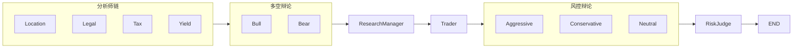

# JapanAI 地产投资建议后端 — 架构说明

本文档说明日本地产投资建议多 Agent 后端的代码结构、数据流与扩展方式，便于阅读与二次开发。

---

## 一、整体架构

本系统采用与 [TradingAgents](https://github.com/...) 同构的 **「多分析师 → 多空辩论 → 研究经理 → 交易员 → 风控辩论 → 风控裁判」** 流程，仅将标的从「股票」改为「地产」，并增加法律/税务/地段/收益四类分析师。



- **分析师**：各带工具（如 `get_location_data`），通过 dataflows 拉取数据，产出专项报告写入 state。
- **Bull/Bear**：无工具，读四份报告与辩论历史，轮流发言，更新 `investment_debate_state`。
- **Research Manager**：读辩论与报告，结合 BM25 记忆，产出 `investment_plan` 与立场（Buy/Hold/Avoid）。
- **Trader**：读投资计划与报告，产出可执行计划，且必须包含 `FINAL RECOMMENDATION: **BUY/HOLD/AVOID**`。
- **风控辩论**：Aggressive / Conservative / Neutral 轮流读交易员计划与报告，更新 `risk_debate_state`。
- **Risk Judge**：读风控辩论与交易员计划，产出 `final_decision`（BUY/HOLD/AVOID + 理由）。

所有节点共享同一 **RealEstateAgentState**，数据仅通过 state 在节点间传递。

---

## 二、目录与模块说明

```
japanAI/
├── japanai/
│   ├── __init__.py
│   ├── default_config.py       # 默认 LLM、数据源等配置
│   ├── real_estate_graph.py    # 图主入口：RealEstateGraph.propagate()
│   ├── agents/                 # 所有 Agent 节点与状态
│   │   ├── utils/
│   │   │   ├── agent_states.py # RealEstateAgentState, InvestDebateState, RiskDebateState
│   │   │   ├── memory.py       # BM25 情境-建议记忆
│   │   │   ├── agent_utils.py  # create_msg_delete
│   │   │   ├── location_tools.py
│   │   │   ├── legal_tools.py
│   │   │   ├── tax_tools.py
│   │   │   └── yield_tools.py
│   │   ├── analysts/           # 区域、法律、税务、收益分析师
│   │   ├── researchers/        # Bull、Bear
│   │   ├── managers/          # Research Manager、Risk Manager
│   │   ├── trader/             # Trader
│   │   └── risk_mgmt/          # Aggressive、Conservative、Neutral
│   ├── dataflows/              # 数据层
│   │   ├── config.py           # get_config / set_config
│   │   ├── interface.py       # route_to_vendor(method, ...)
│   │   └── mock_vendor.py      # 当前 mock 实现
│   ├── llm_clients/            # LLM 工厂与 OpenAI 兼容客户端
│   ├── graph/                  # 图编排
│   │   ├── conditional_logic.py
│   │   ├── propagation.py
│   │   ├── setup.py
│   │   └── signal_processing.py
│   └── api/                    # FastAPI
│       └── app.py              # POST /advise
├── main.py                     # 命令行单次运行
├── run_api.py                  # 启动 uvicorn
├── requirements.txt
├── pyproject.toml
└── ARCHITECTURE.md             # 本文件
```

---

## 三、状态定义（agent_states.py）

- **InvestDebateState**：多空辩论子状态。包含 `bull_history`、`bear_history`、`history`、`current_response`、`judge_decision`、`count`。由 Bull/Bear 更新 `history` 与 `current_response`，由 Research Manager 写入 `judge_decision`。
- **RiskDebateState**：风控辩论子状态。包含三方 history、`latest_speaker`、各 `current_*_response`、`judge_decision`、`count`。由三方辩论员更新，由 Risk Judge 写入 `judge_decision`。
- **RealEstateAgentState**：继承 `MessagesState`，包含：
  - 输入：`property_of_interest`、`user_profile`、`trade_date`
  - 四份报告：`location_report`、`legal_report`、`tax_report`、`yield_report`
  - 辩论与计划：`investment_debate_state`、`investment_plan`、`trader_investment_plan`、`risk_debate_state`、`final_decision`

每个节点函数签名为 `(state) -> dict`，只返回需要**更新**的 state 字段（如 `{"location_report": "..."}`），LangGraph 会做 state 合并。

---

## 四、数据流（dataflows）

- **interface.py**：对外只暴露 `route_to_vendor(method, *args, **kwargs)`。Agent 侧工具（如 `get_location_data`）内部调用 `route_to_vendor("get_location_data", region, purpose)`，不直接依赖具体数据源。
- **config**：通过 `set_config(config)` 注入（由 `RealEstateGraph` 在初始化时调用），`get_vendor(method)` 从 config 的 `tool_vendors` / `data_vendors` 解析出当前使用的 vendor（默认 `mock`）。
- **mock_vendor.py**：当前唯一实现，返回静态/规则化文本。后续可在此增加真实 API 调用（如国土交通省地价、税率接口），并在 `VENDOR_METHODS` 中注册新 vendor。

---

## 五、分析师与工具

- 每个分析师节点：使用 `ChatPromptTemplate` + `MessagesPlaceholder("messages")`，将 `llm.bind_tools(tools)` 后的 chain 对 `state["messages"]` 做 `invoke`。若返回消息带 `tool_calls`，图会路由到对应 `tools_*` 节点（ToolNode）执行，再回到该分析师；若无 `tool_calls`，则将该轮 `content` 写入对应 `*_report`。
- **Msg Clear**：在每个分析师完成后、进入下一分析师前，可选执行 `create_msg_delete()` 节点，清空 messages 并加占位消息，避免上下文过长。

工具与分析师对应关系：

- `get_location_data` → Location Analyst → `location_report`
- `get_legal_faq` → Legal Analyst → `legal_report`
- `get_tax_rules` → Tax Analyst → `tax_report`
- `get_yield_inputs` → Yield Analyst → `yield_report`

---

## 六、辩论与裁判

- **Bull/Bear**：提示词中注入四份报告、辩论 history、对方上一轮发言、以及 `memory.get_memories(curr_situation, n_matches=2)` 的「过去反思」。输出追加到 `investment_debate_state.history` 与各自 `bull_history`/`bear_history`，并更新 `current_response`、`count`。
- **Research Manager**：读辩论 history 与四份报告，结合 past_memory_str，要求输出明确立场（Buy/Hold/Avoid）与投资计划摘要，写入 `investment_plan` 和 `investment_debate_state.judge_decision`。
- **Trader**：读 `investment_plan` 与报告，输出必须以 `FINAL RECOMMENDATION: **BUY/HOLD/AVOID**` 结尾，写入 `trader_investment_plan`。
- **风控三方**：轮流读 `trader_investment_plan` 与报告、对方最新发言，更新 `risk_debate_state`；**Risk Judge** 读辩论与交易员计划，输出 `final_decision`。

---

## 七、图编排（graph/setup.py）

- 使用 `StateGraph(RealEstateAgentState)` 建图。
- **分析师链**：START → 第一个分析师 → 条件边（有 tool_calls → tools_* → 回到该分析师；否则 → Msg Clear → 下一分析师）→ 最后一分析师 Msg Clear 后 → Bull Researcher。
- **多空辩论**：Bull ↔ Bear，由 `should_continue_debate` 根据 `count` 与 `current_response` 决定下一跳；达到轮次后 → Research Manager。
- **Research Manager → Trader**：固定边。
- **风控辩论**：Trader → Aggressive → Conservative → Neutral → Aggressive → …，由 `should_continue_risk_analysis` 根据 `count` 与 `latest_speaker` 决定；达到轮次后 → Risk Judge → END。

---

## 八、LLM 与配置

- **llm_clients**：`create_llm_client(provider, model, base_url?, **kwargs)` 返回 `BaseLLMClient`，当前支持 `openai`、`ollama`、`openrouter`。深思用 `deep_think_llm`（Research Manager、Risk Judge），快思用 `quick_think_llm`（分析师、Bull/Bear、Trader、风控辩论员）。
- **default_config.py**：可配置 `llm_provider`、`deep_think_llm`、`quick_think_llm`、`backend_url`、`data_vendors`、`tool_vendors` 等。

---

## 九、API 与入口

- **POST /advise**：请求体为 `property_of_interest`、`user_profile`、可选 `trade_date`；返回 `signal`（BUY/HOLD/AVOID）、`final_decision`、以及各 report 与 plan 摘要。
- **main.py**：直接调用 `RealEstateGraph().propagate(...)` 并打印结果，便于本地调试。
- **run_api.py**：启动 `uvicorn japanai.api.app:app`，默认 0.0.0.0:8000。

---

## 十、扩展建议

1. **数据源**：在 `dataflows/` 下新增 vendor（如 `gov_land_price.py`），在 `interface.VENDOR_METHODS` 中注册，并在 config 中指定 `data_vendors` / `tool_vendors`。
2. **反思与记忆**：可仿照 TradingAgents 增加 `Reflector`，在用户反馈「买/没买、收益如何」后，根据 state 与回报生成反思，并调用各 memory 的 `add_situations([(situation, recommendation)])`。
3. **流式输出**：若需对前端流式返回，可在 `propagate` 中使用 `graph.stream(...)` 并逐 chunk 推送（如 SSE）。
4. **提示词**：各节点提示词集中在对应 agent 文件中，可根据实际效果调整「日本地产必备因素」列表（继承税、非居住者源泉、折旧等）以及输出格式要求。

---

以上为 JapanAI 地产投资建议后端的整体架构与注释说明。若需某一块的代码级说明，可直接打开对应文件，关键逻辑处已加注释。
